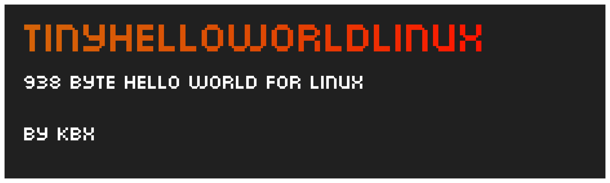

# tinyhelloworld Linux

A C Hello World program that compiles into 940 bytes.

You will need to have [sstrip](https://github.com/aunali1/super-strip "sstrip") installed on your system for this to compile.

betterGZ is a modified version of gzexe which removes some bloat that it produces.

